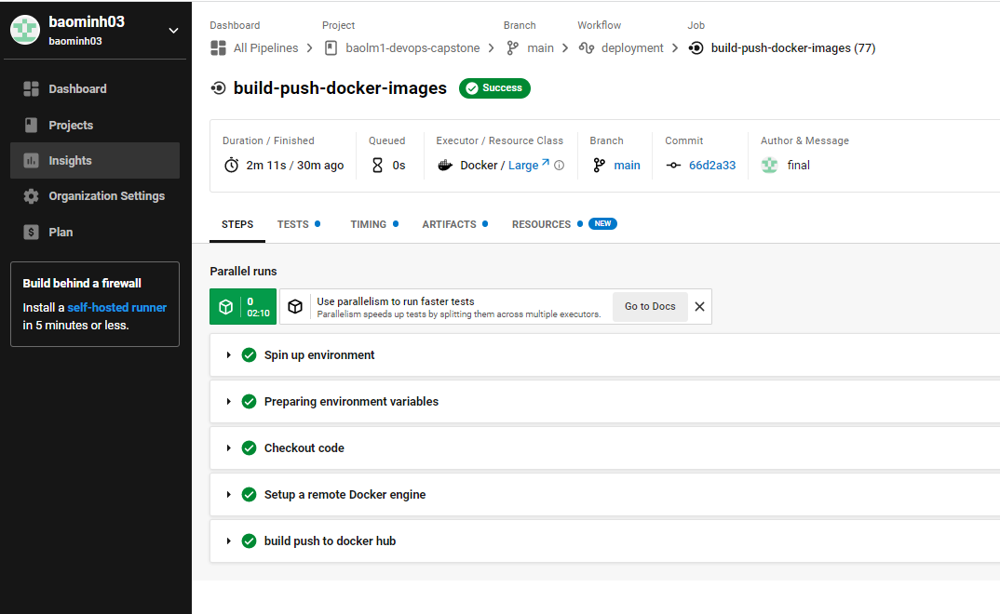
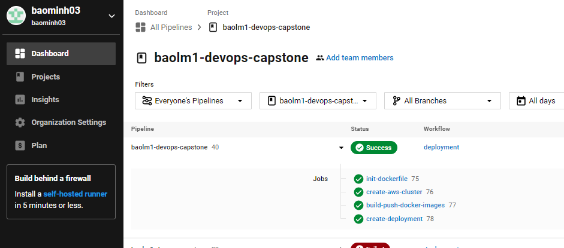
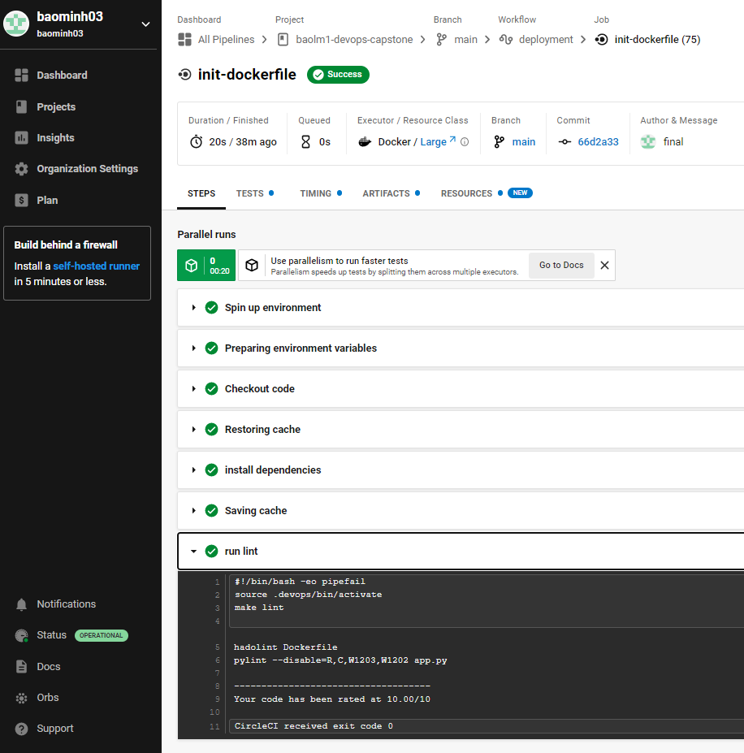
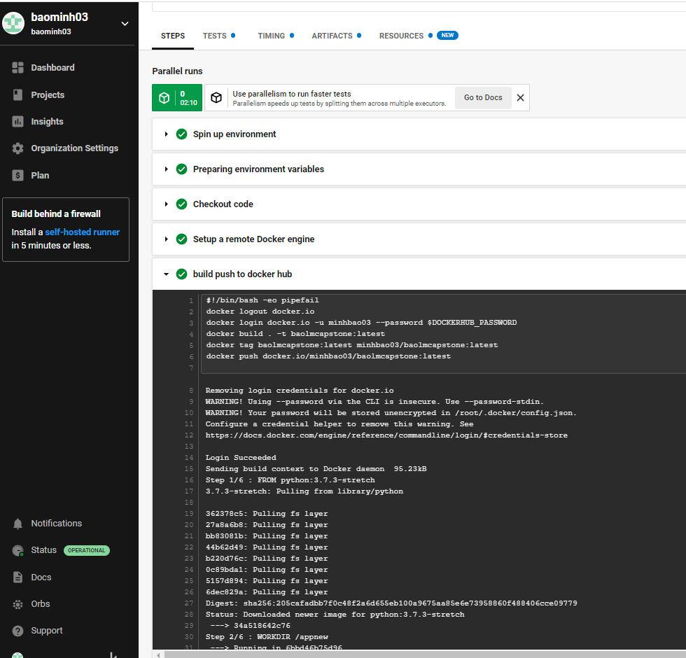
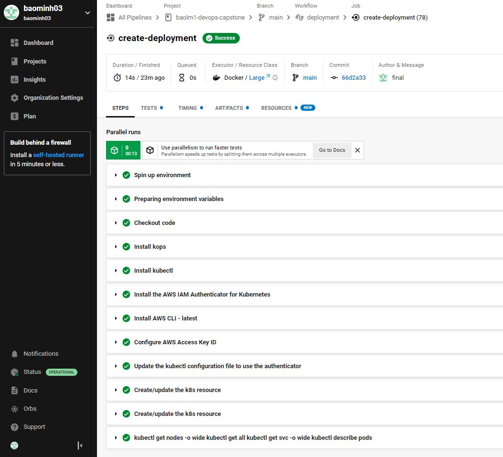

# baolm1-devops-capstone

## Set Up Pipeline

1. Create Github repository with project code: https://github.com/baominh03/baolm1-devops-capstone

2. Use image repository to store Docker images: https://app.circleci.com/pipelines/github/baominh03/baolm1-devops-capstone

## Build Docker Container

1. Execute linting step in code pipeline: 

2. Build a Docker container in a pipeline: 

## Successful Deployment  

1. The Docker container is deployed to a Kubernetes cluster: 

2. Use Blue/Green Deployment or a Rolling Deployment successfully: 

